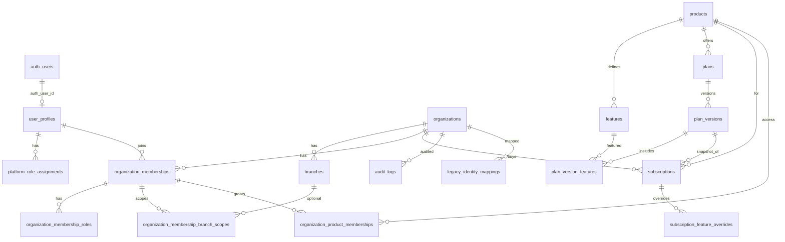

# Platform Database Blueprint

## 1. Status

**DRAFT — Phase 1C** · Schema: PostgreSQL `platform`  
อ้างอิง: `CENTRAL_AUTH_FOUNDATION.md`, `ADR-001-CENTRAL_AUTH_AND_TENANCY.md`  
ยังไม่ใช่ Prisma / SQL / Migration

## 2. Scope

ออกแบบเฉพาะ `platform` สำหรับ identity context, ลูกค้า, สาขา, สมาชิก, โปรแกรม, แพ็กเกจ, Subscription, Entitlement, Audit, Outbox, Idempotency, Legacy mapping  

นอกขอบเขต: `resident_v2` / `hr` / `qrstation`, Product RBAC ละเอียด, Device credential ลึก, การสร้าง project จริง  

Project ระยะยาว: `auth` | `platform` | `resident_v2` | `hr` | `qrstation`

## 3. Design Principles

1. `auth.users` เจ้าของบัญชี/รหัสผ่าน — ห้ามตาราง password ของเรา  
2. PK = UUID · เวลา = `timestamptz`  
3. Platform = SoT ของ Organization/Branch · Product ห้ามสร้างเอง  
4. Product อ้าง `organizationId`, `branchId`, `authUserId` โดยไม่มี FK ข้าม schema  
5. ใน `platform` ใช้ FK ได้ตามปกติ  
6. Soft delete / status — ห้าม hard delete ข้อมูลสำคัญ  
7. เปลี่ยนสิทธิ์/Subscription/ข้อมูลสำคัญ → Audit  
8. Provisioning และ Migration ต้อง Idempotent  
9. Client ห้ามกำหนด org/role/entitlement · Service Role ห้ามอยู่ใน Browser  
10. Plan Version ที่ publish แล้วและราคาที่ขายแล้วห้ามแก้ย้อนหลัง  

## 4. Schema Boundary

| ชนิด | ตาราง |
|------|--------|
| Global | `user_profiles`, `platform_role_assignments`, `products`, `features`, `plans`, `plan_versions`, `plan_version_features` |
| Org-scoped | `organizations`, `branches`, memberships (+ roles/scopes), `subscriptions`, overrides, `organization_product_memberships`, `audit_logs`, `legacy_identity_mappings` |
| Immutable / history | published plan versions + features, subscription snapshots, `audit_logs`, outbox payloads |
| Reliability | `outbox_events`, `idempotency_keys` |

- **Product DB เก็บ (copy ไม่ใช่ FK):** `organizationId`, `branchId`, `authUserId`  
- **ผ่าน Platform API:** invite/create user, org/branch truth, membership, subscription/entitlement, session revoke  
- **Cache ได้ (TTL สั้น):** ชื่อ/สถานะ org-branch, product membership, feature codes  
- **ห้าม:** Product แก้ `platform.*` โดยตรง  

## 5. Entity Relationship Overview

## 6. Table Definitions

รูปแบบต่อตาราง: หน้าที่ · PK · FK · คอลัมน์สำคัญ · Unique/Index · Status · ห้ามแก้ย้อนหลัง

### Identity

**`user_profiles`** — โปรไฟล์ผูก Central Auth + `session_version` สำหรับ logout ทุกอุปกรณ์  
PK `id` · อ้าง `auth_user_id` → `auth.users.id`  
คอลัมน์: `auth_user_id`, `email`, `display_name`, `status`, `session_version`, `last_login_at`, `created_at`, `updated_at`, `deleted_at?`  
Unique: `auth_user_id`, `email` · Index: `status` · Status: `ACTIVE|DISABLED|PENDING`  
ห้ามแก้: `auth_user_id` หลังสร้าง (ยกเว้น migration + audit)

**`platform_role_assignments`** — บทบาท Platform  
PK `id` · FK `user_profile_id`  
คอลัมน์: `role`, `status`, `assigned_at`, `assigned_by_auth_user_id`, `revoked_at?`  
Unique ACTIVE `(user_profile_id, role)` · Role: `SUPER_ADMIN|SUPPORT|BILLING_ADMIN`  
ห้ามลบประวัติ — revoke ด้วย status/เวลา

### ลูกค้าและสาขา

**`organizations`** — tenant SoT  
PK `id` · คอลัมน์: `customer_code`, `slug`, `legal_name`, `display_name`, `status`, `tax_id?`, `timezone`, `currency`, `created_at`, `updated_at`, `deleted_at?`  
Unique: `customer_code`, `slug` · Status: `ACTIVE|SUSPENDED|CLOSED`  
ห้ามแก้: `customer_code` (slug alias = deferred)

**`branches`** — สาขา  
PK `id` · FK `organization_id`  
คอลัมน์: `code`, `name`, `status`, `timezone`, `address?`, `latitude?`, `longitude?`, `attendance_radius_meters?`, timestamps, `deleted_at?`  
Unique `(organization_id, code)` · Index `(organization_id, status)` · Status: `ACTIVE|INACTIVE`  
ห้ามแก้: `organization_id`

### Membership (แยกชั้น — ห้ามรวมเป็น JSON ก้อนเดียว)

**`organization_memberships`** — สมาชิก org  
PK `id` · FK `organization_id`, `user_profile_id`  
คอลัมน์: `status`, `joined_at`, `invited_by_auth_user_id?`, `ended_at?`, timestamps  
Unique `(organization_id, user_profile_id)` · Status: `INVITED|ACTIVE|SUSPENDED|REMOVED`

**`organization_membership_roles`** — org roles  
PK `id` · FK `membership_id` · คอลัมน์: `role`, `status`, `assigned_at`, `revoked_at?`  
Unique ACTIVE `(membership_id, role)` · Role: `OWNER|ADMIN|BILLING_CONTACT`

**`organization_membership_branch_scopes`** — ขอบเขตสาขา  
PK `id` · FK `membership_id`, `branch_id?` · คอลัมน์: `scope_type`, `branch_id?`, `status`, `created_at`  
`ALL_BRANCHES` (1 แถว, branch null) · `SELECTED` (หลายแถวมี branch) · `NONE` (ไม่มีสิทธิ์สาขา)  
Unique: membership เดียวสำหรับ ALL/NONE · `(membership_id, branch_id)` สำหรับ SELECTED

### โปรแกรมและแพ็กเกจ

**`products`** — แคตตาล็อกโปรแกรม  
PK `id` · `code`, `name`, `status`, timestamps · Unique `code`  
Seed: `RESIDENT|HR|QRSTATION` · Status: `ACTIVE|RETIRED`

**`features`** — feature/entitlement catalog (ไม่ใช่ product RBAC)  
PK `id` · FK `product_id` · `code`, `name`, `description?`, `status`  
Unique `code` ทั้งระบบ · รูปแบบ `product.resource.action`  
เช่น `resident.booking.create`, `hr.payroll.approve`, `qrstation.transaction.read`

**`plans`** — แพ็กเกจ logical  
PK `id` · FK `product_id` · `code`, `name`, `status`, timestamps  
Unique `(product_id, code)` · Status: `ACTIVE|RETIRED`

**`plan_versions`** — snapshot ราคา/สิทธิ์ · **immutable หลัง publish**  
PK `id` · FK `plan_id`  
คอลัมน์: `version_number`, `status`, `billing_cycle_default`, `price_amount`, `currency`, `trial_days?`, `published_at?`, `created_at`  
Unique `(plan_id, version_number)` · Status: `DRAFT|PUBLISHED|RETIRED`  
ห้ามแก้ทุกคอลัมน์หลัง PUBLISHED — สร้าง version ใหม่

**`plan_version_features`** — feature ใน version  
PK `id` · FK `plan_version_id`, `feature_id` · `limit_value?`, `created_at`  
Unique `(plan_version_id, feature_id)` · ห้ามแก้หลัง parent PUBLISHED

### Subscription และสิทธิ์เข้า Product

**`subscriptions`** — การเช่า Product ของ org  
PK `id` · FK `organization_id`, `product_id`, `plan_id`, `plan_version_id`  

| เก็บบน Subscription (snapshot) | อ้างอิง Plan Version |
|--------------------------------|----------------------|
| `plan_code`, `plan_version_number`, `price_amount`, `currency`, `billing_cycle`, `feature_snapshot` | `plan_id`, `plan_version_id` (ชุด feature ต้นทาง) |

คอลัมน์อื่น: `status`, `starts_at`, `ends_at?`, `trial_ends_at?`, `cancelled_at?`, `external_ref?`, timestamps  
Status: `TRIAL|ACTIVE|PAST_DUE|SUSPENDED|CANCELLED|EXPIRED` · Cycle: `MONTHLY|YEARLY|MANUAL`  
หนึ่ง org ซื้อได้หลาย product · ห้าม subscription “ใช้งาน” ซ้ำ product เดียว  
ห้ามแก้ snapshot หลัง activate — เปลี่ยนแพ็กเกจผ่าน flow ใหม่ + audit

**`subscription_feature_overrides`** — grant/revoke/limit ราย subscription  
PK `id` · FK `subscription_id`, `feature_id`  
`effect` (`GRANT|REVOKE|LIMIT`), `limit_value?`, `reason?`, `status`, `created_at`, `ends_at?`  
Unique ACTIVE `(subscription_id, feature_id)`

**`organization_product_memberships`** — user เข้า product ใน org ได้หรือไม่ (product role ละเอียดอยู่ที่ Product DB)  
PK `id` · FK `membership_id`, `product_id`, `organization_id` (+ `user_profile_id` denorm)  
`status`, `granted_at`, `revoked_at?` · Unique `(organization_id, user_profile_id, product_id)`  
Status: `ACTIVE|SUSPENDED|REVOKED` · ใช้งานได้เมื่อ membership + entitlement ผ่าน

### ความน่าเชื่อถือและการเชื่อมระบบ

**`audit_logs`** — insert-only  
PK `id` · FK `organization_id?`  
`actor_auth_user_id?`, `action`, `entity_type`, `entity_id`, `before_json?`, `after_json?`, `ip?`, `user_agent?`, `created_at`  
Index: `(organization_id, created_at)`, `(entity_type, entity_id)`, `actor_auth_user_id`

**`outbox_events`** — provision/sync ไป Product  
PK `id` · `aggregate_type`, `aggregate_id`, `event_type`, `payload_json`, `organization_id?`, `status`, `attempts`, `available_at`, `processed_at?`, `last_error?`, `created_at`, `idempotency_key?`  
Status: `PENDING|PROCESSING|PROCESSED|FAILED|DEAD`  
Index `(status, available_at)` · Unique `idempotency_key` เมื่อมี · ห้ามแก้ `payload_json`

**`idempotency_keys`** — กัน mutation/provision ซ้ำ  
PK `id` · `key`, `scope`, `request_hash`, `response_json?`, `status`, `created_at`, `expires_at`  
Unique `(scope, key)` · Status: `IN_PROGRESS|COMPLETED|FAILED`

**`legacy_identity_mappings`** — เชื่อม Legacy โดยไม่มี FK ไป Legacy DB  
PK `id` · FK `organization_id` เท่านั้น  
`legacy_auth_user_id`, `central_auth_user_id`, `legacy_employee_id`, `new_employee_id?`, `organization_id`, `migration_status`, `notes?`, timestamps  
Unique ตาม `(organization_id, legacy_auth_user_id)` / `(organization_id, legacy_employee_id)`  
Status: `PENDING|LINKED|MIGRATED|FAILED|IGNORED`

## 7. Master Tables (no Prisma/PostgreSQL enums)

**Architecture rule:** `GoldenSoft uses master tables instead of Prisma/PostgreSQL enums.`

ทุกสถานะ / ประเภท / Role / รอบบิลเป็น Master Model แยกใน schema `platform`  
ฟิลด์มาตรฐาน: `id`, `code` (unique), `name_th`, `name_en`, `description?`, `sort_order`, `is_active`, `is_system`, timestamps  
Business tables อ้างด้วย FK (`status_id`, `role_id`, `billing_cycle_id`, …)

| Master | Seed codes (system) |
|--------|---------------------|
| PlatformRole | SUPER_ADMIN, SUPPORT, BILLING_ADMIN |
| OrganizationRole | OWNER, ADMIN, BILLING_CONTACT |
| UserProfileStatus | ACTIVE, DISABLED, PENDING |
| OrganizationStatus | ACTIVE, SUSPENDED, CLOSED |
| BranchStatus | ACTIVE, INACTIVE |
| MembershipStatus | INVITED, ACTIVE, SUSPENDED, REMOVED |
| AssignmentStatus | ACTIVE, REVOKED |
| BranchScopeType | ALL_BRANCHES, SELECTED, NONE |
| ProductStatus / FeatureStatus / PlanStatus | ACTIVE, RETIRED |
| PlanVersionStatus | DRAFT, PUBLISHED, RETIRED |
| SubscriptionStatus | TRIAL, ACTIVE, PAST_DUE, SUSPENDED, CANCELLED, EXPIRED |
| BillingCycle | MONTHLY, YEARLY, MANUAL |
| SubscriptionOverrideType | GRANT, REVOKE, LIMIT |
| ProductMembershipStatus | ACTIVE, SUSPENDED, REVOKED |
| OutboxEventStatus | PENDING, PROCESSING, PROCESSED, FAILED, DEAD |
| IdempotencyStatus | IN_PROGRESS, COMPLETED, FAILED |
| LegacyMigrationStatus | PENDING, LINKED, MIGRATED, FAILED, IGNORED |
| FeatureValueType | STRING, NUMBER, BOOLEAN |
| AuditActionType | organization.bootstrap, … |

Product seed codes (business catalog, not status masters): RESIDENT, HR, QRSTATION

## 8. Constraints and Indexes

1. Unique `organizations.slug`  
2. Unique `organizations.customer_code`  
3. Unique `(branches.organization_id, code)`  
4. Unique `(organization_memberships.organization_id, user_profile_id)`  
5. Unique `products.code`  
6. Unique `(plans.product_id, code)`  
7. Unique `(plan_versions.plan_id, version_number)`  
8. Unique `features.code`  
9. Unique `(organization_product_memberships.organization_id, user_profile_id, product_id)`  
10. Partial unique: หนึ่ง subscription ใช้งานต่อ `(organization_id, product_id)` เมื่อ status ∈ {TRIAL, ACTIVE, PAST_DUE, SUSPENDED}  
11. Index `subscriptions(status, ends_at)`  
12. Index `audit_logs(organization_id, created_at)`  
13. Index `outbox_events(status, available_at)`  
14. Unique `user_profiles.auth_user_id`  
15. Unique `(idempotency_keys.scope, key)`  

## 9. Immutable and Historical Data

- `plan_versions` + `plan_version_features` หลัง PUBLISHED → สร้าง version ใหม่เท่านั้น  
- Snapshot บน `subscriptions` คงที่หลัง activate  
- `audit_logs` insert-only · `outbox_events.payload_json` ห้ามแก้  
- Soft-delete เก็บแถวเพื่อประวัติ  
- ลูกค้าเก่าใช้ `plan_version_id` + snapshot แม้มี version ใหม่  

## 10. MVP Tables

ใช้ Login / Org / Branch / Membership / Product / Plan / Subscription / Entitlement / Audit พื้นฐาน  
บวก Master tables ทั้งหมดใน §7:

Business: `user_profiles`, `user_preferences`, `platform_role_assignments`, `organizations`, `branches`, `organization_memberships`, `organization_membership_roles`, `organization_membership_branch_scopes`, `products`, `features`, `plans`, `plan_versions`, `plan_version_features`, `subscriptions`, `subscription_feature_overrides`, `organization_product_memberships`, `audit_logs`, `outbox_events`, `idempotency_keys`, `legacy_identity_mappings`

## 11. Deferred Tables (7 กลุ่ม)

ชื่อเท่านั้น — ไม่ลงรายละเอียด:

| แนวคิด | เลื่อนเพราะ |
|--------|-------------|
| `payment_customers` / `payment_intents` | Automated Payment Gateway |
| `coupons` / `coupon_redemptions` | Coupon |
| `tax_invoices` / lines | Tax Invoice เต็มรูปแบบ |
| `support_access_grants` | Advanced Support Approval |
| `qr_device_credentials` | QR Device Credential (D007) |
| `organization_slug_aliases` | Slug Alias / Redirect (D012) |
| `usage_records` | Usage-based Billing |

## 12. Security Invariants

1. Service Role Key ห้ามอยู่ใน Browser  
2. ทุก API ตรวจ Auth + Organization + Product access + Entitlement/Permission  
3. Business record ใน Product ต้องมี `organizationId`  
4. ข้อมูลสาขาต้องมี `branchId`  
5. Client ห้ามกำหนดสิทธิ์/org/entitlement เอง  
6. Product ห้ามแก้ schema ของ Platform หรือ Product อื่น  
7. Legacy DB = read-only export · mapping ไม่มี FK ไป Legacy  
8. เปลี่ยนสิทธิ์และ Subscription ต้องมี Audit  
9. Payroll/PII — สิทธิ์เฉพาะใน Product · SUPPORT ต้องอนุมัติแยก (deferred)  
10. Provision/Migration ใช้ idempotency / natural unique  
11. เพิ่ม `session_version` เมื่อเปลี่ยนรหัสผ่าน ปิด user หรือเหตุ security  
12. Fail closed เมื่อ membership/subscription/entitlement ไม่ชัด  

## 13. Open Questions

1. เก็บ `activeOrganizationId` / `activeBranchId` ที่ preference table, cookie, หรือทั้งสอง?  
2. `feature_snapshot` เป็น JSONB หรือแถว `subscription_features` แยก?  
3. Add-on ใน MVP = override อย่างเดียว หรือ subscription แยก?  
4. Seat/branch limit เก็บที่ plan version อย่างไร?  
5. ใน project เดียวจะใส่ FK `auth_user_id → auth.users` หรือ soft reference เท่านั้น?  
6. Retention ของ `audit_logs` และ `outbox_events`?  
7. Bootstrap OWNER membership ของ org ใหม่ทำอย่างไร?  
8. Entitlement ที่ resolve แล้ว cache ที่ Product นานเท่าใด?  

## 14. Acceptance Checklist

- [ ] ตาราง Identity, Org/Branch, Membership แยกชั้น, Product/Plan/Version, Subscription, Product membership, Audit, Outbox, Idempotency, Legacy mapping ครบ  
- [ ] สอดคล้อง ADR D001–D012 และ Security Invariants  
- [ ] Unique / partial unique / index ตามหัวข้อ 8  
- [ ] Plan version + subscription snapshot รองรับลูกค้าเก่า  
- [ ] ไม่มี FK ไป Legacy · Product ไม่ FK กลับ platform  
- [ ] แยก MVP / Deferred ชัด · ไม่มี SQL/Prisma ในเอกสาร  
- [ ] พร้อมเป็น input Phase ถัดไปเมื่อได้รับอนุมัติ  
)
